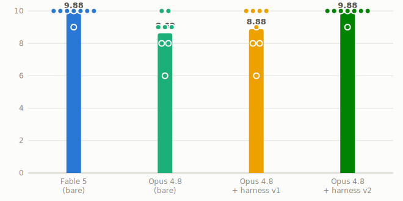

# fability

A Claude Code harness that closes the discipline gap between Claude Opus 4.8 and Claude Fable 5 — by mechanism, not by prompt.

Fability is a harness for pushing Opus 4.8 closer to Fable 5 behavior by turning Fable-like discipline into explicit protocols, system-prompt injection, and hook-level enforcement.

日本語版: [README.ja.md](README.ja.md)

## Results

Discipline benchmark: 4 tasks × 5-criterion rubric × 8 runs per condition, scored by a blind Sonnet 5 judge plus mechanical checks.

| Condition | Mean total (/10) | sd |
|---|---|---|
| Fable 5 (bare) | 9.88 | 0.35 |
| Opus 4.8 (bare) | 8.62 | 1.30 |
| Opus 4.8 + harness v1 (prompt injection only) | 8.88 | 1.46 |
| **Opus 4.8 + harness v2** | **9.88** | **0.35** |

On this benchmark, Opus 4.8 + harness v2 scores identical to bare Fable 5 — down to the per-criterion means.

[](eval/results/report.html)

Figure: mean total score by condition; dots are individual runs. Open the full interactive report: [`eval/results/report.html`](eval/results/report.html). Full written analysis: [`eval/results/summary.md`](eval/results/summary.md).

The v1→v2 delta is the project's central finding: **discipline must be delivered as mechanism, not instruction.**

- v1 injected the kernel as session context (SessionStart hook). The verification hard gate almost never fired; scores stayed near bare Opus 4.8.
- v2 (a) injects the kernel into the system prompt, and (b) adds a Stop hook that mechanically bounces any completion claim lacking evidence of a full-test-suite run. Verification discipline (C2) went from 1.25 to 2.00.

## Principle

Fable 5's prompting guide is effectively a catalog of behaviors Fable 5 exhibits naturally. Opus 4.8 follows instructions literally and faithfully. So: convert the Fable 5 behavior catalog into explicit protocols, and use Opus 4.8's instruction-following — backed by hook-level enforcement where instruction alone fails — as the delivery mechanism.

## Layout

- `kernel/kernel.md` — 6 standing disciplines + skill dispatch table + completion gate (v2: injected into the system prompt)
- `hooks/stop-verify.sh` — Stop hook; bounces completion claims that lack a full-suite test run (the core of v2)
- `hooks/session-start.sh` — SessionStart hook (v1-style kernel injection)
- `skills/` — 6 protocol skills (deep-insight, spec-first, fresh-verify, long-run, session-memory, grounded-report)
- `agents/` — verifier (fresh-context adversarial verifier) / investigator (parallel hypothesis tester)
- `eval/` — measurement pipeline (run tasks × models × harness conditions, score against the 5-criterion rubric)

## Install

Run the installer from this repository root:

```bash
./install.sh
```

The installer:

- installs the six protocol skills with `npx skills add` into `~/.claude/skills`
- symlinks the verifier/investigator agents into `~/.claude/agents`
- merges the SessionStart and Stop hooks into `~/.claude/settings.json`
- backs up an existing settings file before editing it

After installation, start a new Claude Code session. You do not need to explicitly invoke the skills for the main harness behavior: the SessionStart hook injects the kernel automatically, and the Stop hook mechanically enforces full-suite verification before completion claims.

To install only the skills directly with `npx` from this repository root:

```bash
npx --yes skills@latest add . \
  --global \
  --agent claude-code \
  --skill '*' \
  --full-depth \
  --yes
```

This leaves unrelated existing skills alone. A same-named installed skill may be updated. This installs the skills only; it does not enable the kernel or Stop hook. Use `./install.sh` for the turnkey harness.

## Uninstall

Remove the fability skills with `npx`:

```bash
npx --yes skills@latest remove \
  deep-insight fresh-verify grounded-report long-run session-memory spec-first \
  --global \
  --agent claude-code \
  --yes
```

Do not use `--all` or `--skill '*'` unless you intend to remove all matching skills. The `npx skills remove` command does not remove the `~/.claude/agents` symlinks or `~/.claude/settings.json` hook entries; remove those separately if needed.

## Running the evaluation

```
./eval/run.sh <task-dir> <model> <off|on|on2> <rep>   # one condition
python3 eval/grade.py <run-dir>                        # score (mechanical checks + blind LLM judge)
python3 eval/report.py                                 # regenerate aggregation + charts (report.html)
./eval/matrix.sh                                       # full matrix
```

`off` = no harness / `on` = v1 (SessionStart injection) / `on2` = v2 (system prompt + Stop hook)

## Documents

- Design spec: `docs/specs/2026-07-05-fability-design.md` (Japanese)
- Implementation plan: `docs/plans/2026-07-05-fability.md` (Japanese)
- Experiment results & diagnosis: `eval/results/summary.md`
